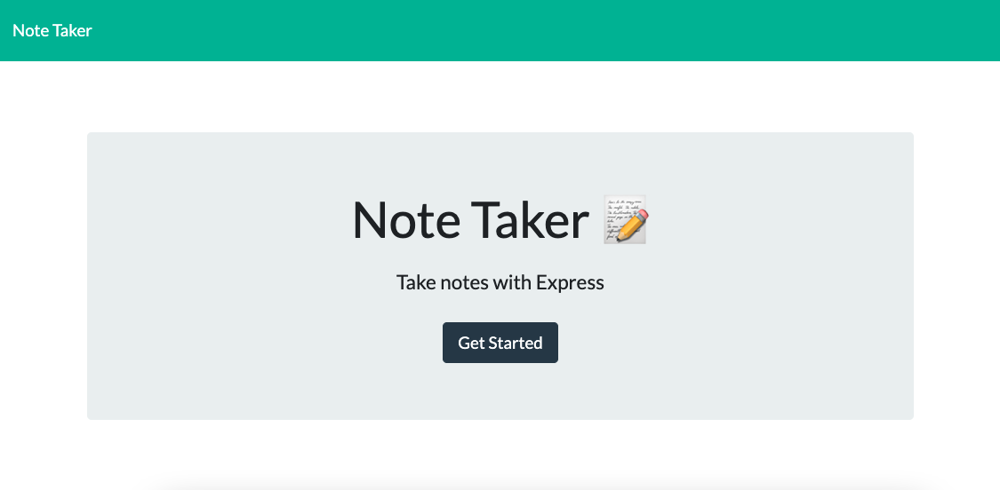
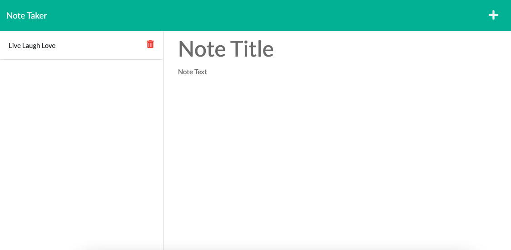
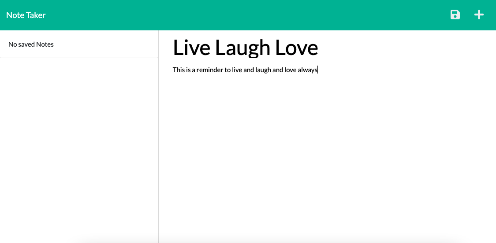

# Note-Taker            
## Description
Users can create and delete notes through this web app

## Usage
To create a note, select get started. Enter the note title and content, and select the floppy disc icon to save your note. View your saved notes on the left side of the screen. To delete a note, select the red trash bin icon. 
## Screenshots

            

## Links
https://note-taker-nw.herokuapp.com/
            
https://github.com/scottguenther94/Note-Taker
